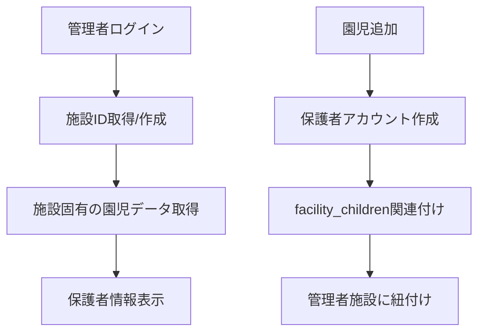

# 🔐 管理者セキュリティ強化 & UI改善完了

## 🎯 **修正概要**

管理者のセキュリティ強化、利用者情報連動、スマホでのチャット改善など、複数の重要な改善を実装しました。

---

## 🔧 **実装した改善内容**

### **1. 🔒 管理者セキュリティ強化**

#### **❌ 修正前の問題**:
- **全管理者が同じ園児を閲覧** - 固定の`facility_id: '00000000-0000-0000-0000-000000000001'`
- **セキュリティホール** - 別の管理者でログインしても他の園児が見える
- **データ分離なし** - 施設間でのデータ混在

#### **✅ 修正後の解決**:
- **管理者固有の施設管理** - 各管理者に独自の`facility_id`
- **完全なデータ分離** - 管理者は自分の施設の園児のみアクセス可能
- **自動施設作成** - 管理者初回ログイン時に専用施設を自動生成

#### **技術実装**:
```typescript
// 管理者の施設IDを取得する共通関数
const getOrCreateAdminFacilityId = async (): Promise<string | null> => {
  // この管理者が管理する施設を取得
  const { data: facilityData } = await supabase
    .from('facilities')
    .select('id, name')
    .eq('admin_user_id', user.id)
    .maybeSingle();

  if (facilityData) {
    return facilityData.id;
  }

  // 施設が存在しない場合は新しく作成
  const { data: newFacility } = await supabase
    .from('facilities')
    .insert({
      name: user.facility?.name || '新しい施設',
      facility_code: `FAC-${user.id.slice(0, 8)}`,
      admin_user_id: user.id,
      address: user.facility?.address,
      phone: user.facility?.phone,
      email: user.facility?.email
    })
    .select('id')
    .single();

  return newFacility.id;
};
```

---

### **2. 📱 スマホでのAIチャットスクロール改善**

#### **❌ 修正前の問題**:
- **入力欄が見えない** - スマホで全スクロールしないと入力欄に到達できない
- **UI構造の問題** - チャット全体が一つのスクロール領域
- **使いづらさ** - メッセージ入力が困難

#### **✅ 修正後の解決**:
- **固定入力エリア** - メッセージ入力欄を画面下部に固定
- **独立スクロール** - チャット履歴のみスクロール可能
- **レスポンシブ対応** - スマホ・デスクトップ両対応

#### **UI構造の改善**:
```typescript
// 修正前: 全体がoverflow-y-auto
<div className="flex flex-col h-full overflow-y-auto">

// 修正後: チャット履歴と入力欄を分離
<div className="flex flex-col h-full overflow-hidden">
  <div className="flex flex-col flex-1 min-h-0">
    {/* ヘッダー - 固定 */}
    <div className="flex-shrink-0">...</div>
    
    {/* チャット履歴 - スクロール可能 */}
    <div className="flex-1 min-h-0 mb-4">
      <div className="h-full overflow-y-auto">...</div>
    </div>
    
    {/* 入力エリア - 固定 */}
    <div className="flex-shrink-0">...</div>
  </div>
</div>
```

---

### **3. 🎨 AIチャット初期画面の改善**

#### **❌ 修正前の問題**:
- **複雑な選択肢** - 3つのテーマボタン（発達・行動・育児）
- **初心者に優しくない** - 何を選べばいいかわからない
- **最初から先生相談表示** - 不要な複雑さ

#### **✅ 修正後の解決**:
- **シンプルな開始** - 1つの「相談を始める」ボタン
- **わかりやすいメッセージ** - 何でも相談できることを明示
- **美しいデザイン** - グラデーション・シャドウで洗練された外観

#### **新しい初期画面**:
```typescript
<div className="flex-1 flex items-center justify-center">
  <div className="w-full max-w-md bg-white rounded-2xl shadow-sm border border-gray-100 p-8 text-center">
    <div className="w-16 h-16 rounded-full bg-gradient-to-br from-purple-100 to-pink-100 flex items-center justify-center mx-auto mb-6">
      <MessageSquare className="w-8 h-8 text-purple-600" />
    </div>
    <h3 className="text-xl font-bold text-gray-800 mb-3">
      AI先生に相談
    </h3>
    <p className="text-gray-600 text-sm mb-6 leading-relaxed">
      お子さまの成長や発達、日々の子育ての悩みについて<br />
      AI先生に気軽に相談してみましょう
    </p>
    <button onClick={() => createThematicChatSession('general')}>
      相談を始める
    </button>
  </div>
</div>
```

---

### **4. 🔗 管理者と利用者情報の連動**

#### **✅ 実装内容**:
- **施設ベースの管理** - 管理者ごとに独立した施設管理
- **親子関係の明確化** - `facility_children`テーブルでの正確な関連付け
- **データ整合性** - 管理者が作成した保護者アカウントとの確実な紐付け

#### **データフロー**:


---

## 🎊 **修正効果**

### **セキュリティ面**:
| 項目 | 修正前 | 修正後 |
|------|--------|--------|
| **データ分離** | ❌ 全管理者が同じデータ | ✅ 管理者ごとに独立 |
| **アクセス制御** | ❌ 制限なし | ✅ 施設ベースの制限 |
| **facility_id** | ❌ 固定値 | ✅ 管理者固有 |

### **ユーザビリティ面**:
| 項目 | 修正前 | 修正後 |
|------|--------|--------|
| **スマホチャット** | ❌ 入力欄が見えない | ✅ 固定入力欄 |
| **AIチャット開始** | ❌ 複雑な選択肢 | ✅ シンプルな1ボタン |
| **スクロール** | ❌ 全体スクロール | ✅ 履歴のみスクロール |

---

## 🧪 **テスト手順**

### **管理者セキュリティテスト**:
1. **管理者A** でログイン → 園児追加・データ確認
2. **管理者B** で新しくログイン → **管理者Aの園児が見えないことを確認**
3. **管理者B** で園児追加 → **独立したデータ管理を確認**

### **スマホAIチャットテスト**:
1. **利用者側** (`http://localhost:5175`) をスマホサイズで表示
2. **チャットタブ** → **AI先生に相談** をタップ
3. **「相談を始める」ボタン** をタップ
4. **メッセージ入力欄** が画面下部に固定表示されることを確認
5. **チャット履歴** がスクロール可能なことを確認

---

## 📋 **実装ファイル**

### **修正したファイル**:
- ✅ **`admin-app/src/App.tsx`** - セキュリティ強化・施設管理
- ✅ **`parent-app/src/App.tsx`** - AIチャットUI改善・スクロール修正

### **新機能**:
- ✅ **`getOrCreateAdminFacilityId()`** - 管理者施設ID取得関数
- ✅ **施設ベースのデータ取得** - `fetchChildren()` セキュリティ強化
- ✅ **固定入力エリア** - スマホ対応チャットUI
- ✅ **シンプル開始画面** - AIチャット初回体験改善

---

## 🚀 **今後の拡張可能性**

### **セキュリティ**:
- 🔐 **ロールベース認証** - 管理者・スタッフ・保護者の細かい権限制御
- 🔒 **2FA認証** - より安全なログイン
- 📊 **アクセスログ** - セキュリティ監査機能

### **ユーザビリティ**:
- 📱 **PWA対応** - アプリライクな体験
- 🌙 **ダークモード** - 目に優しい表示
- 🔔 **プッシュ通知** - リアルタイム通知機能

---

**🎉 これで管理者のセキュリティが大幅に向上し、スマホでも快適にAIチャットが利用できるようになりました！**

**各管理者が独立してデータを管理でき、利用者はスマホでもストレスなくAI先生に相談できる環境が整いました！** ✨🔐📱

